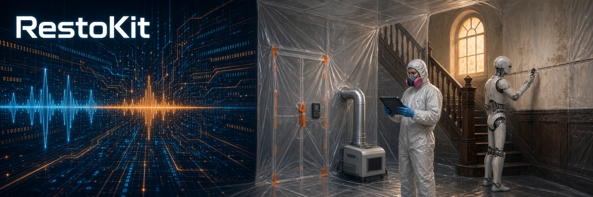

<p align="center"></p>

<p align="center"><strong>A restoration kit for water, mold, and crawlspace work, from tech to lead, PM, and estimator.</strong></p>

<p align="center">
  
  
  
  
  
</p>

<p align="center">
  <a href="#-what-it-is">What it is</a> ·
  <a href="#%EF%B8%8F-what-it-covers-on-a-job">What it covers on a job</a> ·
  <a href="#-checks-the-kit-calls-out">Checks the kit calls out</a> ·
  <a href="#-the-science-behind-the-calls">The science behind the calls</a> ·
  <a href="#-how-to-use-it">How to use it</a> ·
  <a href="#-how-it-answers">How it answers</a> ·
  <a href="#-how-it-grows">How it grows</a> ·
  <a href="#-where-its-headed">Where it's headed</a> ·
  <a href="#-for-shops">For shops</a> ·
  <a href="#-about">About</a> ·
  <a href="#%EF%B8%8F-kit-structure">Kit structure</a> ·
  <a href="#-a-note-on-this-repo">A note on this repo</a>
</p>

---

## 🧰 What it is

RestoKit is a structured JSON kit that loads into an AI model and works alongside anyone running a restoration job, from tech and lead to project manager and estimator. It's grounded in IICRC S500 (water) and S520 (mold) principles and written in a peer voice, the way a senior tech talks a job through. For now it runs on commercial models only.

It has two layers:

- **Phases:** a linear job flow with gates in a set order, so safety-critical steps don't get skipped under time pressure.
- **Modules and base science:** a reference pool the steps point into for the why. It covers category, remove-vs-dry, containment, equipment sizing, drying science, mold cleaning, and crawlspaces.

It's senior field knowledge in a form a tech, lead, PM, or estimator can use. It doesn't replace years on the job. Its main job is memory: it holds the rare edge-case lessons that don't come up often enough to stay top of mind.

## 🏗️ What it covers on a job

- **Phase 0, Hold Status:** Minimum stabilization while a job waits on approval, abatement, or a plumber. That means protecting contents, flagging hazards, putting up minimal containment, and documenting the hold and the wet-time clock.
- **Phase 1, Initial Response & Stabilization:** A signed work authorization comes before any physical work. Then: a job-type check, the safety walk and category check, source control, bulk extraction, and baseline readings in affected and unaffected areas. It also covers crawlspace inspection and asbestos sampling in pre-1980 homes before destructive work.
- **Phase 2, Selective Demolition & Post-Demo Cleaning:** Remove vs. dry-in-place by material, category, and dwell time. Controls are upgraded before demo, and demo runs top-down. Hidden water gets chased into cavities, under LVP, and along base plates. Then post-demo cleaning and an equipment re-set.
- **Phase 3, Active Drying & Monitoring:** Daily temperature, RH, and GPP readings, plus dehumidifier grain depression. Moisture readings go at the same points every visit, and containment gets re-checked. If progress stalls after 48–72 hours of proper conditions, the kit calls for a root-cause check.
- **Phase 4, Verification & Closeout:** Controls stay up and teardown waits until final moisture verification passes. Then the cavity and crawlspace inspection, customer walkthrough, and documentation package.

## ✅ Checks the kit calls out

- **Category:** When unsure, go with the higher category. Water from under a toilet is Category 3 until proven otherwise. A strong musty or sewage odor overrides appearance.
- **Electrical:** Standing water plus live circuits means stop. Kill it at the breaker, verify it's dead, and use GFCI on temp power.
- **Crawlspaces:** Every crawl gets a 4-gas check (O₂, CO, H₂S/sewer gas). Never work one alone, and never push crawl air up into the house.
- **Containment:** Minimal containment on every job, even Category 1. Full containment before demo or when contamination risk rises. Never bag a live HVAC return.
- **Negative air:** Target about −5 Pa continuous, sized for 4+ air changes per hour. If a gas appliance is in or next to the chamber, check flue draft and plan makeup air.
- **Dry standard:** Match the unaffected material in the same building. For wood, that's within about 2–4 points. The ≤16 / 16.1–19.9 / ≥20% traffic light is a risk band, not a second dry standard.
- **Mold:** The condition labels Normal, Settled, and Colonized are ranked by severity, not a timeline. Kill is not remove, because dead spores stay a reservoir.

## 🔬 The science behind the calls

- Read RH and temp, log GPP. RH for the quick check, GPP to compare days, rooms, and dehu inlet vs. outlet, since RH shifts with temperature.
- Vapor pressure and vapor drive
- Wicking, capillary action, and free vs. bound moisture
- Material behavior, including LVP and other modern flooring that traps water underneath
- Equipment sizing by water class and cubic footage, and the displacement principle behind tenting and ducting

---

## 🚀 How to use it

RestoKit is a single JSON file. There's nothing to install and no code to run.

1. **Load it.** Open the Grok app or a Grok Bot and attach `resto_kit_0.8.9.json`, or add it to a project or bot's knowledge so it stays loaded.
2. **Tell it the job.** For example, "Category 2 supply-line leak, kitchen and crawlspace, 1990s house, I'm the PM."
3. **Ask one thing at a time.** For example, "What's Phase 1?", "Remove or dry this LVP?", "Containment before demo?", or "Is the subfloor dry?" It answers from the kit's phases, checks, and science, and goes deeper only when you ask.

The full kit is private for now. A demo is available on request.

## 📋 How it answers

Each step carries a short summary line. Ask about one step and you get only that part, not the whole module. Deeper detail stays in the reference layer until you ask for it. The short lines are also written to work read aloud.

**Example answer:**

> "Full containment before demo. Neg air target: about minus five pascals continuous, or more negative. Quick check: bounce a quarter on the six-mil. If it's flat or flapping, you lost pressure."

## 🌱 How it grows

RestoKit grows from daily job logs. A lesson goes into the kit only after it proves itself on real jobs, as a short note in the module that owns it.

The current version is **0.8.9**.

## 🧭 Where it's headed

Next up is connecting the field scope to Xactimate so the scope and the estimate line up.

---

## 🤝 For shops

A demo of the kit is available on request. From there, Jason can build a company version around a shop's own procedures.

## 👤 About

RestoKit is built by **Jason Burns**, a restoration tech and builder in Portland, OR, and a U.S. Army Engineer veteran.

- GitHub: [github.com/neuresthetics](https://github.com/neuresthetics)
- Email: [neuresthetics@gmail.com](mailto:neuresthetics@gmail.com)

---

## 🗂️ Kit structure

Layout of the kit two levels deep. Each section lists the keys inside it; contents omitted.

```jsonc
{
  "framework": "…",  // Kit identifier
  "meta": ["author", "description", "repository", "version", "date"],  // Author, version, date, and kit description
  "framework_scale": [  // Rules for when modules grow into shallow trees
    "purpose", "core_principle", "triggers_for_tree", "tree_design_rules", "restructuring_process",
    "what_stays_flat", "current_candidates", "success_test", "remembering_function",
    "runtime_contracts"
  ],
  "main_content": {
    "phases": {
      "phase0": [  // Hold Status: minimal stabilization while a job waits
        "name", "frequency", "objective", "sequence", "hold_reasons", "minimal_actions_only",
        "when_to_resume", "pm_board_alignment", "voice_note", "resume_voice_line"
      ],
      "phase1": ["name", "objective", "sequence", "pm_board_alignment", "phase_collapse_note"],  // Initial Response & Stabilization
      "phase2": ["name", "objective", "sequence", "pm_board_alignment"],  // Selective Demolition & Post-Demo Cleaning
      "phase3": ["name", "objective", "sequence", "pm_board_alignment"],  // Active Drying & Monitoring
      "phase4": ["name", "objective", "sequence", "pm_board_alignment"]  // Verification & Closeout
    },
    "modules": {
      "demolition": ["title", "description", "tree", "voice_entry_points"],  // Remove-vs-dry decisions, demo sequence, controls, post-demo clean
      "crawlspaces": ["title", "description", "tree", "voice_entry_points"],  // Crawl safety, inspection, insulation, airflow, vapor barrier
      "special_situations": ["title", "description", "tree", "voice_entry_points"],  // High-complexity homes needing elevated PPE and sequencing
      "leadership_and_labor": [  // Crew leadership and labor distribution
        "description", "core_principle", "key_considerations", "voice_considerations",
        "pump_truck_deployment"
      ],
      "practical_judgment": [  // Sound technical calls under real-world constraints
        "description", "core_principle", "key_considerations", "minimize_passes", "voice_note",
        "noise_mitigation", "good_enough", "remembering_edge_cases"
      ],
      "emergency_calls": [  // Triage for after-hours and urgent calls
        "title", "description", "triage_questions", "true_emergency_criteria",
        "non_emergency_examples", "emotional_reaction_handling", "on_site_protocol",
        "mitigation_to_restoration_note", "voice_considerations", "heavy_sewage_override"
      ],
      "service_contract": [  // Work authorization before scope or demo
        "description", "key_activities", "critical_decision_points", "practical_guidance",
        "voice_considerations", "life_safety_carve_out"
      ],
      "initial_assessment": [  // First on-site evaluation
        "description", "key_activities", "critical_decision_points", "practical_guidance",
        "voice_considerations"
      ],
      "source_control": [  // Stopping and verifying the water source
        "description", "key_activities", "critical_decision_points", "practical_guidance",
        "voice_considerations"
      ],
      "extraction": [  // Removing standing water
        "description", "key_activities", "critical_decision_points", "practical_guidance",
        "voice_considerations"
      ],
      "ambient_humidity_assessment": [  // Quick RH and temp screen before equipment
        "title", "description", "traffic_light", "key_activities", "voice_line", "integration",
        "scope_note"
      ],
      "contents_handling": ["description", "key_activities", "contents_return", "voice_considerations"],  // Protecting, moving, cleaning, and returning contents
      "engineering_controls": [  // Negative pressure, air filtration, and related controls
        "description", "key_activities", "critical_decision_points", "practical_guidance",
        "voice_considerations", "negative_pressure_targets", "gas_appliance_backdraft"
      ],
      "containment": [  // Containment types, build sequence, and blowouts
        "zipper_doors", "types", "philosophy", "blowout", "hvac_intake_ban",
        "gas_appliance_backdraft_check", "core_mindset", "when_to_use", "recommended_sequence",
        "voice_note", "voice_considerations", "recommended_sequence_voice_chunks"
      ],
      "extension_cord_safety": ["description", "key_rules", "practical_guidance", "voice_considerations"],
      "electrical_safety": ["description", "key_rules", "practical_guidance", "voice_considerations", "voice_note"],
      "drying_and_monitoring": [  // Drying setup, tenting, dry standards, dehu ducting
        "description", "key_activities", "tenting", "critical_decision_points", "practical_guidance",
        "voice_considerations", "references", "monitoring_module_note", "dry_standards",
        "moisture_after_spray", "dehumidifier_ducting"
      ],
      "general_cleaning": ["description", "core_approach", "practical_tips", "voice_note"],
      "ulv_vs_hand_pump_sprayer": ["description", "key_rules", "rules_of_thumb", "when_not_to_use_ulv", "financial_note"],  // Choosing an application method for antimicrobials
      "trash_management_and_logistics": [  // Debris handling and hauling
        "description", "core_approaches", "daily_handling", "vehicle_loading",
        "contaminated_material", "equipment_decisions", "key_principles"
      ],
      "final_verification": [  // Final moisture checks before teardown
        "description", "key_activities", "critical_decision_points", "practical_guidance",
        "voice_considerations"
      ],
      "job_closeout": [  // Teardown, walkthrough, and closing the job
        "description", "key_activities", "critical_decision_points", "practical_guidance", "warnings",
        "voice_considerations"
      ],
      "documentation": [  // Documentation habits across the job
        "description", "core_principle", "key_habits", "decision_criteria", "practical_guidance",
        "warnings", "voice_considerations"
      ],
      "category_decision": [  // Verifying or upgrading water category on site
        "description", "key_activities", "critical_decision_points", "practical_guidance",
        "voice_considerations"
      ],
      "hazard_sampling": [  // Asbestos and hazardous material sampling
        "description", "key_activities", "critical_decision_points", "practical_guidance",
        "voice_considerations"
      ],
      "limited_targeted_access": [  // Low-risk access before full demo
        "description", "key_activities", "critical_decision_points", "practical_guidance",
        "voice_considerations"
      ],
      "equipment_setup": [  // Equipment placement and sizing
        "description", "key_activities", "critical_decision_points", "industry_rules_of_thumb",
        "sizing_and_calculations", "practical_guidance", "references", "voice_considerations",
        "noise_reduction"
      ],
      "van_organization": [  // Work vehicle setup
        "description", "core_principle", "vehicle_type_recommendations",
        "cab_separation_and_contamination_control", "clean_dirty_flow", "functional_zones",
        "racking_and_shelving", "theft_and_security", "weather_adaptations",
        "van_cleaning_and_maintenance", "professional_appearance", "comfort_and_quality_of_life",
        "daily_reset_habits", "voice_considerations"
      ],
      "mcgyver": [  // Practical field improvisations
        "name", "description", "core_principle", "trigger_phrases", "field_fixes",
        "voice_considerations", "edge_case_memory"
      ],
      "insurance_dynamics": [  // Working within carrier rules
        "description", "key_realities", "field_reality", "practical_guidance", "voice_considerations",
        "honesty_guard"
      ],
      "monitoring": [  // Daily monitoring methods and trend logging
        "description", "core_principle", "key_principles", "fixed_point_techniques",
        "long_dwell_sewage_handling", "integration", "voice_considerations"
      ],
      "mold_cleaning": [  // Mold cleaning approach, sequence, and condition labels
        "title", "description", "core_principle", "customer_notify", "cleaning_stacks",
        "practical_approach", "voice_note", "moisture_after_spray_note", "spore_reservoir",
        "kill_then_remove", "condition_labels"
      ],
      "ale": ["title", "description", "status", "deferred_reason", "voice_note"],  // Additional living expense notes
      "electricity_bills": ["title", "description", "status", "deferred_reason", "voice_note"],  // Equipment power cost notes
      "_structure_note": ["description"],  // Internal note on module layout
      "job_type_gate": ["title", "rule", "example", "voice_note"]  // Confirm the job type before loading water modules
    },
    "base_science": {
      "water_category": [
        "description", "category_1", "category_2", "category_3", "time_and_migration",
        "decision_rules", "nuances", "voice_notes"
      ],
      "psychrometry": ["description", "core_concepts", "field_implication", "voice_note"],
      "moisture_physics": ["description", "core_concepts", "field_implications"],
      "water_movement_pathways": [
        "description", "core_mechanisms", "layering_and_drainage", "horizontal_pathways",
        "vertical_pathways", "high_probability_collection_points", "field_implications", "voice_notes"
      ],
      "evaporation_principles": ["description", "core_concepts", "field_implication"],
      "dry_standards": ["description", "core_principle", "wood", "non_wood_materials", "insulation_rule", "voice_note"],
      "contamination_science": ["description", "core_concepts", "field_implication"],
      "mold_science": [
        "description", "core_concepts", "key_relationships", "field_implications",
        "common_misunderstandings"
      ],
      "material_behavior": [
        "description", "core_concepts", "key_relationships", "field_implications",
        "common_misunderstandings"
      ],
      "vapor_drive_and_pressure": ["description", "core_concepts", "field_implications"],
      "wood_emc": ["description", "core_concepts", "field_implications"]  // Wood equilibrium moisture content
    },
    "board_stage_aliases": ["purpose", "aliases", "notes"]  // Maps workflow stages to project-board column names
  },
  "update_notes": "…"  // Version-by-version changelog
}
```

## 🔒 A note on this repo

This is a public window into the project. The full kit is kept private. A demo is available on request.
